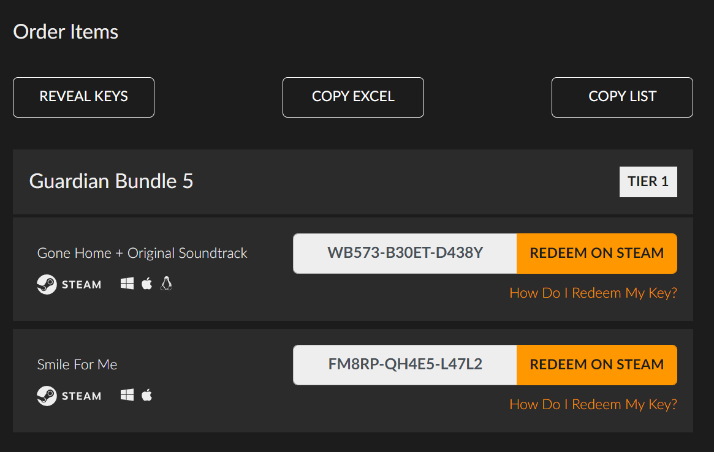

# ✨ Fanatical Enhanced ✨

This script enhanced the famous marketplace **[Fanatical](https://www.fanatical.com/)** adding:

* Add extra options in order page: 
  * Reveal keys with one click.
  * Copy keys on excel format to the clipboard.
  * Copy keys on a list separated by "," to the clipboard.

### Supported sites

- [Fanatical](https://www.fanatical.com/)

## 📌Prerequisites📎

- [Tampermonkey (Chrome)](https://tampermonkey.net)
- [Greasemonkey (Firefox)](http://www.greasespot.net)
- [Violent monkey (Opera)](https://addons.opera.com/sk/extensions/details/violent-monkey/)

## 🖥️Installation🖱️

**Github**

- Enter to the user script file (usually named as <code>*.user.js</code>) you want to install.
- Click on the <code>Raw</code> button, the browser extension will recognize this file as a user script.
- Install it.

That's it!

## 🔧Configuration🔧

No extra configuration required.

## 📷Screenshots📷

### ☕Buy me a coffee☕

- My Amazon [affiliate link](https://amazon.es/?tag=sergiosusa-21) or add this query string ``?tag=sergiosusa-21`` before add a product to the basket when you buy on Amazon spain.
- My Letyshops [referal link](https://letyshops.com/es/winwin?ww=17530599) to get €5 each.
- My Payme [link](https://paypal.me/sergiosusa?locale.x=es_ES) to send me a tip.